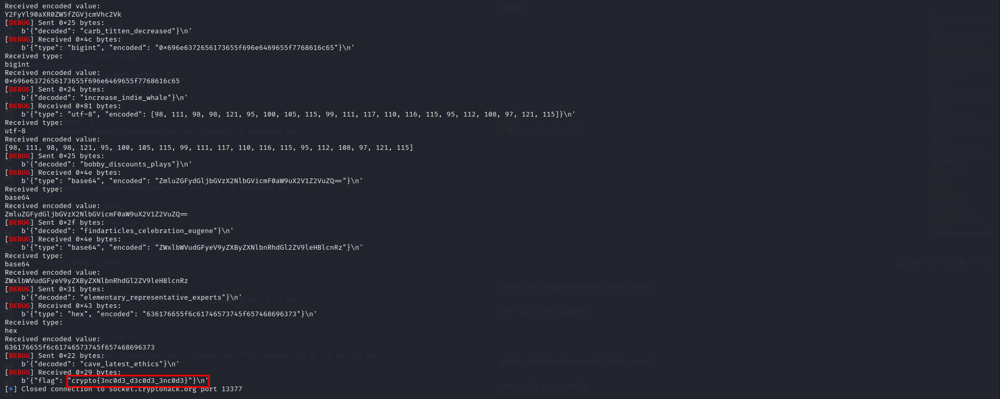

# CryptoHack - Challenges - General/Encoding


This post contains the solution of challenges from general category (encoding) from the CryptoHack.

<!--more-->

## Encoding

### ASCII

**Challenge Description**
```
ASCII is a 7-bit encoding standard which allows the representation of text using the integers 0-127.

Using the below integer array, convert the numbers to their corresponding ASCII characters to obtain a flag.

[99, 114, 121, 112, 116, 111, 123, 65, 83, 67, 73, 73, 95, 112, 114, 49, 110, 116, 52, 98, 108, 51, 125]
```

**Solution**

```python
a = [99, 114, 121, 112, 116, 111, 123, 65, 83, 67, 73, 73, 95, 112, 114, 49, 110, 116, 52, 98, 108, 51, 125]

print("".join([chr(i) for i in a]))
```

**Output**

```
crypto{ASCII_pr1nt4bl3}
```

### Hex

**Challenge Description**
```
When we encrypt something the resulting ciphertext commonly has bytes which are not printable ASCII characters. If we want to share our encrypted data, it's common to encode it into something more user-friendly and portable across different systems.

Hexadecimal can be used in such a way to represent ASCII strings. First each letter is converted to an ordinal number according to the ASCII table (as in the previous challenge). Then the decimal numbers are converted to base-16 numbers, otherwise known as hexadecimal. The numbers can be combined together, into one long hex string.

Included below is a flag encoded as a hex string. Decode this back into bytes to get the flag.

63727970746f7b596f755f77696c6c5f62655f776f726b696e675f776974685f6865785f737472696e67735f615f6c6f747d
```

**Solution**
```python
a = "63727970746f7b596f755f77696c6c5f62655f776f726b696e675f776974685f6865785f737472696e67735f615f6c6f747d"

print(bytes.fromhex(a).decode())
```

**Output**
```
crypto{You_will_be_working_with_hex_strings_a_lot}
```

### Base64

**Challenge Description**
```
Another common encoding scheme is Base64, which allows us to represent binary data as an ASCII string using an alphabet of 64 characters. One character of a Base64 string encodes 6 binary digits (bits), and so 4 characters of Base64 encode three 8-bit bytes.

Base64 is most commonly used online, so binary data such as images can be easily included into HTML or CSS files.

Take the below hex string, decode it into bytes and then encode it into Base64.

72bca9b68fc16ac7beeb8f849dca1d8a783e8acf9679bf9269f7bf
```

**Solution**
```python
import base64 

a = '72bca9b68fc16ac7beeb8f849dca1d8a783e8acf9679bf9269f7bf'
b = bytes.fromhex(a)

print(base64.b64encode(b).decode('utf-8'))
```

**Output**
```
crypto/Base+64+Encoding+is+Web+Safe/
```

### Bytes and Big Integers

**Challenge Description**
```
Cryptosystems like RSA works on numbers, but messages are made up of characters. How should we convert our messages into numbers so that mathematical operations can be applied?

The most common way is to take the ordinal bytes of the message, convert them into hexadecimal, and concatenate. This can be interpreted as a base-16/hexadecimal number, and also represented in base-10/decimal.

To illustrate:

message: HELLO
ascii bytes: [72, 69, 76, 76, 79]
hex bytes: [0x48, 0x45, 0x4c, 0x4c, 0x4f]
base-16: 0x48454c4c4f
base-10: 310400273487
```

**Solution**
```python
from Crypto.Util.number import *

a = 11515195063862318899931685488813747395775516287289682636499965282714637259206269

print(long_to_bytes(a).decode('utf-8'))
```

**Output**
```
crypto{3nc0d1n6_4ll_7h3_w4y_d0wn}
```

### Encoding Challenge

**Challenge Description**
```
Now you've got the hang of the various encodings you'll be encountering, let's have a look at automating it.

Can you pass all 100 levels to get the flag?

The 13377.py file attached below is the source code for what's running on the server. The pwntools_example.py file provides the start of a solution using the incredibly convenient pwntools library. which we recommend. If you'd prefer to use Python's in-built telnetlib, telnetlib_example.py is also provided.

For more information about connecting to interactive challenges, see the FAQ. Feel free to skip ahead to the cryptography if you aren't in the mood for a coding challenge!

Connect at nc socket.cryptohack.org 13377

Challenge files:
  - 13377.py
  - pwntools_example.py
  - telnetlib_example.py

```

**Solution**

If we directly check the `nc socket.cryptohack.org 13377`.

It shows us an encrypted text from either of `hex`, `base64`, `rot13`, `bigint`, and `utf-8`.


Now it will continue asking for decryption for 100 times. You can either do it manually :) but we can simply automate this task using python.

Modifying the attached script `pwntools_example.py` in the challenge, I made the following script to automate the above task and retrieve the flag.

```python
from pwn import * # pip install pwntools
from Crypto.Util.number import bytes_to_long, long_to_bytes
import json
import base64
import codecs
import random


r = remote('socket.cryptohack.org', 13377, level = 'debug')

def json_recv():
    line = r.recvline()
    return json.loads(line.decode())

def json_send(hsh):
    request = json.dumps(hsh).encode()
    r.sendline(request)

for i in range(100):


    received = json_recv()

    print("Received type: ")
    rec_type = received["type"]
    print(rec_type)
    print("Received encoded value: ")
    rec_enc = received["encoded"]
    print(rec_enc)
    
    if (rec_type == "base64"):
        to_send = {
        "decoded": base64.b64decode(rec_enc).decode() # decoding b64
        }
        json_send(to_send)
        
    elif (rec_type == "rot13"):
        to_send = {
        "decoded": codecs.decode(rec_enc, 'rot_13') # decoding rot13
        }
        json_send(to_send)
        
    elif (rec_type == "bigint"):
        to_send = {
        "decoded": bytes.fromhex(rec_enc.replace("0x","")).decode() # bigint to text
        }
        json_send(to_send)
        
    elif (rec_type == "utf-8"):
        to_send = {
        "decoded": "".join([chr(b) for b in rec_enc]) # utf-8 to text
        }
        json_send(to_send)
        
    elif (rec_type == "hex"):
        to_send = {
        "decoded": bytes.fromhex(rec_enc.replace("0x","")).decode('utf-8') # hex to text
        }
        json_send(to_send)

    

json_recv() # retrieve the final flag
```

And we get the flag at the end.



**Thanks for reading!**
